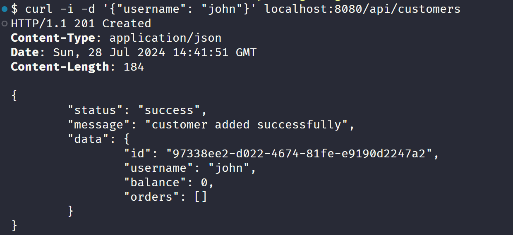
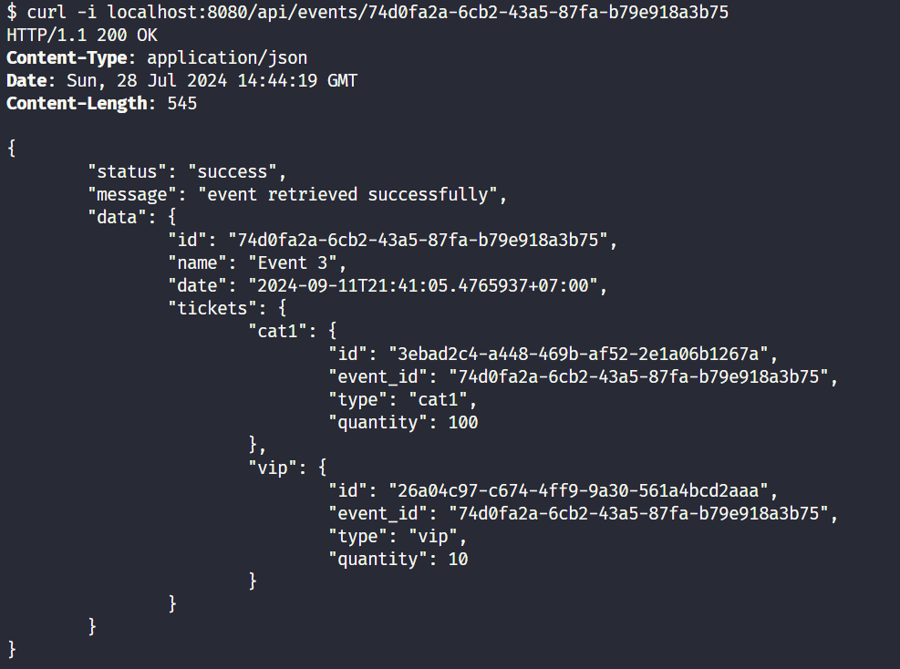
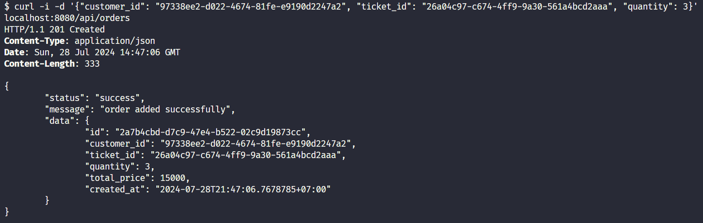
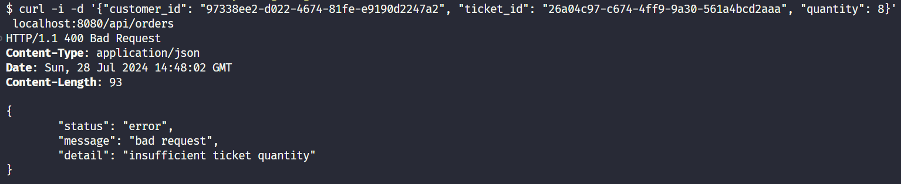
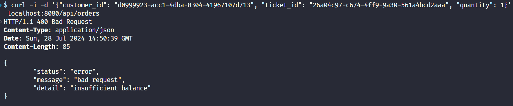
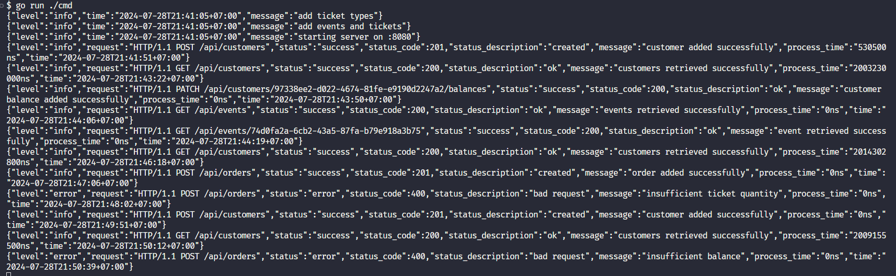

<div align="center">
  <br>
  <h1>Evento</h1>
  <p>🎫 A simple REST API for ordering event tickets online 🎫</p>
  <br>
</div>

## Table of Contents

- [Description](#description)
- [Features](#features)
- [Entities](#entities)
- [API Endpoints](#api-endpoints)
- [Run Locally](#run-locally)
- [Screenshots](#screenshots)

## Description

[`^ back to top ^`](#table-of-contents)

**Evento** is a simple REST API for ordering event tickets online. This API is written in Go. It is created as a submission for the second-week exam in the Go phase of the Backend Development Training.

## Features

[`^ back to top ^`](#table-of-contents)

- View list of customers & their orders.
- Add a new customer.
- View a customer.
- Add balance amount.
- View list of events with the tickets available.
- View an event with the tickets available.
- View list of tickets.
- View a ticket.
- View list of orders.
- Order a ticket.

## Entities

[`^ back to top ^`](#table-of-contents)

There are 5 entities: **Customer**, **TicketType**, **Event**, **Ticket**, & **Order**.

**Customer**

- id: `string`
- username: `string`
- balance: `float64`
- orders: `[]*Order`

**TicketType**

- id: `string`
- name: `TicketTypeName`
- price: `float64`

**Event**

- id: `string`
- name: `string`
- date: `timestamp`
- tickets: `map[TicketTypeName]*Ticket`

**Ticket**

- id: `string`
- event_id `string`
- type `TicketTypeName`
- quantity `int`

**Order**

- id: `string`
- customer_id: `string`
- ticket_id: `string`
- quantity: `int`
- total_price: `float64`
- created_at: `timestamp`

## API Endpoints

[`^ back to top ^`](#table-of-contents)

| **Method** | **Pattern**                 | **Description**                                 |
| ---------- | --------------------------- | ----------------------------------------------- |
| GET        | /api/customers              | View list of customers & their orders.          |
| POST       | /api/customers              | Add a new customer.                             |
| GET        | /api/customers/:id          | View a customer.                                |
| PATCH      | /api/customers/:id/balances | Add balance amount.                             |
| GET        | /api/events                 | View list of events with the tickets available. |
| GET        | /api/events/:id             | View an event with the tickets available.       |
| GET        | /api/tickets                | View list of tickets.                           |
| GET        | /api/tickets/:id            | View a ticket.                                  |
| GET        | /api/orders                 | View list of orders.                            |
| POST       | /api/orders                 | Order a ticket.                                 |

## Run Locally

[`^ back to top ^`](#table-of-contents)

- Make sure you have [Go](https://go.dev) installed on your computer.

- Clone the repo.

  ```bash
  git clone https://github.com/nadiannis/evento.git
  ```

  ```bash
  cd evento
  ```

- Install the dependencies.

  ```bash
  go mod tidy
  ```

- Run the server. The web server will run on port 8080.

  ```bash
  go run ./cmd
  ```

## Screenshots

[`^ back to top ^`](#table-of-contents)

### Add a new customer



### View an event with the tickets available



### Order a ticket (success)



### Order a ticket (ticket out of stock)



### Order a ticket (insufficient balance)



### Log


